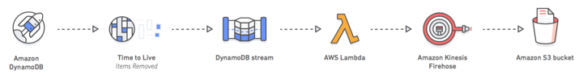

# DynamoDB TTL Stream to S3 Bucket
The purpose of this project is to test DynamoDB TTL delete events and the storage of deleted records into an S3 bucket for audit/tracking purposes.



### Create DynamoDB Table
1. Create a table called ```test_ttl_table``` e.g,:
```
+-----------+--------------------------------------+
| my_pk     | 24e05f94-1788-11ed-861d-0242ac120002 |
+-----------+--------------------------------------+
| firstname | Bob                                  |
+-----------+--------------------------------------+
| lastname  | Adam                                 |
+-----------+--------------------------------------+
| expdate   | 1660010100                           |
+-----------+--------------------------------------+
```
2. Enable TTL for the table with a `number` attribute named ```expdate```
3. Enable DynamoDB stream for the table

### Create Lambda Function w/ TTL Filter
```ssh
aws lambda create-event-source-mapping \
--event-source-arn '<dynamodb_stream_ARN>' \
--batch-size 10 \
--enabled \
--function-name test_ddb_ttl \
--starting-position LATEST \
--filter-criteria \"{\"Filters\": [{"Pattern": "{\"userIdentity\":{\"type\":[\"Service\"],\"principalId\":[\"dynamodb.amazonaws.com\"]}}\"}]}\"
```

Change ```<dynamodb_stream_ARN>``` with the generated DynamoDB table stream ARN.

If you are adding the filter through the AWS Trigger Configuration page, use below:
```json
{"userIdentity":{"type":["Service"],"principalId":["dynamodb.amazonaws.com"]}}
```

Attach ```AWSLambdaInvocation-DynamoDB``` and ```AmazonKinesisFirehoseFullAccess``` policies to the lambda function role.

### Create a Kinesis Data Firehose Delivery stream
Create a new delivery stream that will place data into an S3 bucket of your choice. In this example, 
the generated delivery stream name is ```PUT-S3-CwAUa```.

### Build Java Project
```mvn package```

### Upload JAR File to Lambda
```ssh
aws lambda update-function-code --function-name test_ddb_ttl --zip-file fileb://<lambda_function.jar>
```

Change ```<lambda_function.jar>``` to point to the generated .jar file in the ```/target``` directory.

### Test Record w/ expdate
Create a test record in the ```test_ttl_table``` table and wait until TTL picks up the record.

CloudWatch Logs and the S3 Bucket should contain record details similar to what is below:
```
{
  eventID: 70a21e0f6fc0f4e897952170595355cb,
  eventName: REMOVE,
  eventVersion: 1.1,
  eventSource: aws:dynamodb,
  awsRegion: us-east-1,
  dynamodb: 
  {
    ApproximateCreationDateTime: Wed Aug 10 02:45:47 UTC 2022,
    Keys: 
    {
      my_pk={S: 5fa95c3a-1854-11ed-861d-0242ac120002,}
    },
    OldImage: 
    {
      firstname={S: Reeves,}, 
      my_pk={S: 5fa95c3a-1854-11ed-861d-0242ac120002,}, 
      expdate={N: 1660098720,}, 
      lastname={S: James,}
    },
    SequenceNumber: 20359600000000008434716639,
    SizeBytes: 123,
    StreamViewType: NEW_AND_OLD_IMAGES
  },
  userIdentity: 
  {
    PrincipalId: dynamodb.amazonaws.com,
    Type: Service
  },
  eventSourceArn: arn:aws:dynamodb:us-east-1:************:table/test_ttl_table/stream/2022-08-09T22:16:04.930
}
```
